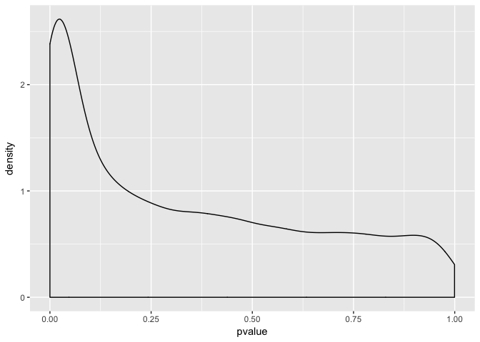

Seminar 3 exercise
================
Sofia Romero
1/23/2018

``` r
#This section is the initial part of the seminar... THE HOMEWORK STARTS FROM THE PLOT

#Calling the libraries
library(GEOquery)
```

    ## Loading required package: Biobase

    ## Loading required package: BiocGenerics

    ## Loading required package: parallel

    ## 
    ## Attaching package: 'BiocGenerics'

    ## The following objects are masked from 'package:parallel':
    ## 
    ##     clusterApply, clusterApplyLB, clusterCall, clusterEvalQ,
    ##     clusterExport, clusterMap, parApply, parCapply, parLapply,
    ##     parLapplyLB, parRapply, parSapply, parSapplyLB

    ## The following objects are masked from 'package:stats':
    ## 
    ##     IQR, mad, sd, var, xtabs

    ## The following objects are masked from 'package:base':
    ## 
    ##     Filter, Find, Map, Position, Reduce, anyDuplicated, append,
    ##     as.data.frame, cbind, colMeans, colSums, colnames, do.call,
    ##     duplicated, eval, evalq, get, grep, grepl, intersect,
    ##     is.unsorted, lapply, lengths, mapply, match, mget, order,
    ##     paste, pmax, pmax.int, pmin, pmin.int, rank, rbind, rowMeans,
    ##     rowSums, rownames, sapply, setdiff, sort, table, tapply,
    ##     union, unique, unsplit, which, which.max, which.min

    ## Welcome to Bioconductor
    ## 
    ##     Vignettes contain introductory material; view with
    ##     'browseVignettes()'. To cite Bioconductor, see
    ##     'citation("Biobase")', and for packages 'citation("pkgname")'.

    ## Setting options('download.file.method.GEOquery'='auto')

    ## Setting options('GEOquery.inmemory.gpl'=FALSE)

``` r
library(biomaRt)
```

    ## Warning: package 'biomaRt' was built under R version 3.4.3

``` r
library(tidyverse)
```

    ## -- Attaching packages --------------------------- tidyverse 1.2.1 --

    ## <U+221A> ggplot2 2.2.1     <U+221A> purrr   0.2.4
    ## <U+221A> tibble  1.4.2     <U+221A> dplyr   0.7.4
    ## <U+221A> tidyr   0.7.2     <U+221A> stringr 1.2.0
    ## <U+221A> readr   1.1.1     <U+221A> forcats 0.2.0

    ## Warning: package 'tibble' was built under R version 3.4.3

    ## -- Conflicts ------------------------------ tidyverse_conflicts() --
    ## x ggplot2::Position() masks BiocGenerics::Position(), base::Position()
    ## x dplyr::combine()    masks Biobase::combine(), BiocGenerics::combine()
    ## x dplyr::filter()     masks stats::filter()
    ## x dplyr::lag()        masks stats::lag()
    ## x dplyr::select()     masks biomaRt::select()

``` r
library(data.table)
```

    ## 
    ## Attaching package: 'data.table'

    ## The following objects are masked from 'package:dplyr':
    ## 
    ##     between, first, last

    ## The following object is masked from 'package:purrr':
    ## 
    ##     transpose

``` r
library(reshape2)
```

    ## Warning: package 'reshape2' was built under R version 3.4.3

    ## 
    ## Attaching package: 'reshape2'

    ## The following objects are masked from 'package:data.table':
    ## 
    ##     dcast, melt

    ## The following object is masked from 'package:tidyr':
    ## 
    ##     smiths

``` r
#meta_data part
gds<- getGEO("GDS507")
```

    ## File stored at:

    ## /var/folders/k6/3jg9sh5d23g4_tx65n4w5r0h0000gn/T//Rtmp1awowv/GDS507.soft.gz

    ## Parsed with column specification:
    ## cols(
    ##   ID_REF = col_character(),
    ##   IDENTIFIER = col_character(),
    ##   GSM11815 = col_double(),
    ##   GSM11832 = col_double(),
    ##   GSM12069 = col_double(),
    ##   GSM12083 = col_double(),
    ##   GSM12101 = col_double(),
    ##   GSM12106 = col_double(),
    ##   GSM12274 = col_double(),
    ##   GSM12299 = col_double(),
    ##   GSM12412 = col_double(),
    ##   GSM11810 = col_double(),
    ##   GSM11827 = col_double(),
    ##   GSM12078 = col_double(),
    ##   GSM12099 = col_double(),
    ##   GSM12269 = col_double(),
    ##   GSM12287 = col_double(),
    ##   GSM12301 = col_double(),
    ##   GSM12448 = col_double()
    ## )

``` r
meta_data <- data.frame(Sample = gds@dataTable@columns$sample, disease = gds@dataTable@columns$disease.state)
#We grab this info from the appropriate slots above. 
data <- gds@dataTable@table
library(RCurl)
```

    ## Warning: package 'RCurl' was built under R version 3.4.3

    ## Loading required package: bitops

    ## 
    ## Attaching package: 'RCurl'

    ## The following object is masked from 'package:tidyr':
    ## 
    ##     complete

``` r
data_with_chromosome<-read.csv(file= "biomart_output.csv")
#full_data: combining the info from meta_data file and expresion table 
full_data <- left_join(data_with_chromosome, meta_data, by = "Sample")
full_data %>% 
    group_by(disease) %>% 
    filter(chromosome_name == "X") %>% 
    summarize(mean = mean(Count))
```

    ## # A tibble: 2 x 2
    ##   disease  mean
    ##   <fct>   <dbl>
    ## 1 RCC       674
    ## 2 normal    729

``` r
#Analyzing the results of statistical tests and DENSITY PLOT
library(ggplot2)
full_data %>% 
    group_by(hgnc_symbol) %>% 
    summarize( pvalue = t.test(Count ~ disease)$p.value) %>% ggplot (aes(x=pvalue))+ geom_density()
```



``` r
#data_frame of pvalues that are lower than 0.005
pvalues<-full_data %>% 
  group_by(hgnc_symbol) %>% 
  summarize( pvalue = t.test(Count ~ disease)$p.value)
pvalues005<-subset(pvalues, pvalue<0.005)
#This is the new data frame
pvalues005
```

    ## # A tibble: 1,070 x 2
    ##    hgnc_symbol   pvalue
    ##    <fct>          <dbl>
    ##  1 ABCB1       0.00351 
    ##  2 ABCC6P1     0.000528
    ##  3 ABHD14B     0.000621
    ##  4 ABHD17C     0.000344
    ##  5 ABI3        0.000807
    ##  6 ABL2        0.00171 
    ##  7 ACADSB      0.00153 
    ##  8 ACOT8       0.00244 
    ##  9 ACOX1       0.000421
    ## 10 ACSL5       0.00471 
    ## # ... with 1,060 more rows

``` r
#Name of the gene with the lowest expression: Filtering the name of the gene that vas the lowest p value, I found those genes by subsetting those genes which pvalue is equal to the min value previously found
min_pvalue_name<-pvalues[which(pvalues$pvalue == min(pvalues$pvalue)),]
min_pvalue_name
```

    ## # A tibble: 1 x 2
    ##   hgnc_symbol        pvalue
    ##   <fct>               <dbl>
    ## 1 CLDN2       0.00000000591

``` r
#Name of the gene: CLDN2
```
