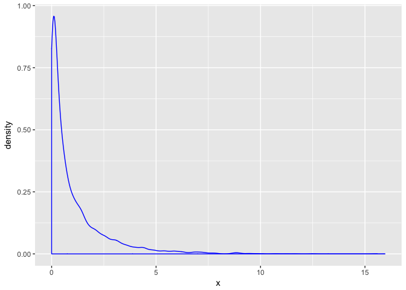
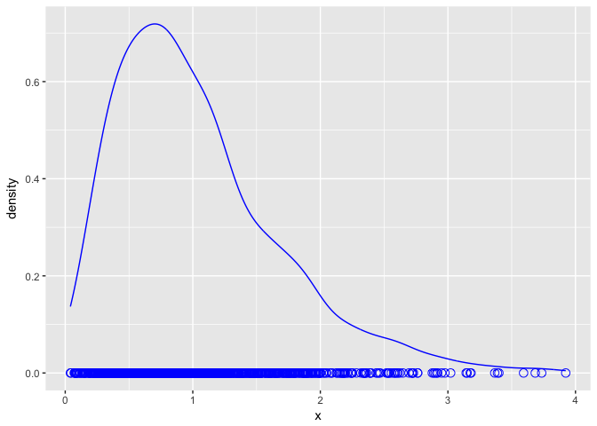

Seminar 2C
================
Sofia Romero
1/16/2018

``` r
library(tidyverse)
```

    ## -- Attaching packages ------------------------ tidyverse 1.2.1 --

    ## <U+221A> ggplot2 2.2.1     <U+221A> purrr   0.2.4
    ## <U+221A> tibble  1.4.1     <U+221A> dplyr   0.7.4
    ## <U+221A> tidyr   0.7.2     <U+221A> stringr 1.2.0
    ## <U+221A> readr   1.1.1     <U+221A> forcats 0.2.0

    ## -- Conflicts --------------------------- tidyverse_conflicts() --
    ## x dplyr::filter() masks stats::filter()
    ## x dplyr::lag()    masks stats::lag()

``` r
set.seed(1)
sampleSize <- 5
numSamples <- 1000

degreeFreedom <- 1

randomChiSqValues <- rchisq(n = numSamples * sampleSize, df = degreeFreedom)

tibble(x= randomChiSqValues) %>% ggplot () + geom_density(aes(x=x), color= "blue")
```



``` r
samples <- matrix(randomChiSqValues, nrow = numSamples, ncol = sampleSize)
sampleMeans <- rowMeans(samples) # work out the sample means 

head(sampleMeans)
```

    ## [1] 0.9271741 1.3116297 0.5027606 0.3370594 2.0871492 0.3149406

``` r
tibble(x = sampleMeans) %>% 
  ggplot() + 
  geom_line(aes(x = x), stat = "density", color = "blue") +
  geom_point(aes(x = x, y = 0), color = "blue", shape = 1, size = 3)
```


