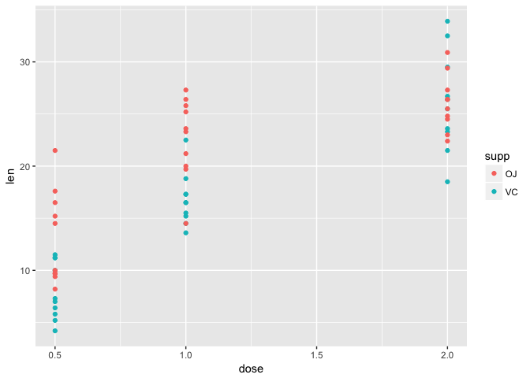

Practice assigment
================
Sofia Romero
17 January, 2018

PART 1: Data inspection
=======================

Titanic
=======

### This data set contains information on the fate of passengers on the fatal maiden voyage of the ocean liner 'Titanic', summarized according to a)economic status (class) b)sex c) age d)survival. Here is presented the data set as a data frame:

``` r
Titanic<-data.frame(Titanic) #Here we are converting the dataset Titanic in a data frame, and saving it with the same name "Titanic". 
Titanic #Printing the data frame.  
```

    ##    Class    Sex   Age Survived Freq
    ## 1    1st   Male Child       No    0
    ## 2    2nd   Male Child       No    0
    ## 3    3rd   Male Child       No   35
    ## 4   Crew   Male Child       No    0
    ## 5    1st Female Child       No    0
    ## 6    2nd Female Child       No    0
    ## 7    3rd Female Child       No   17
    ## 8   Crew Female Child       No    0
    ## 9    1st   Male Adult       No  118
    ## 10   2nd   Male Adult       No  154
    ## 11   3rd   Male Adult       No  387
    ## 12  Crew   Male Adult       No  670
    ## 13   1st Female Adult       No    4
    ## 14   2nd Female Adult       No   13
    ## 15   3rd Female Adult       No   89
    ## 16  Crew Female Adult       No    3
    ## 17   1st   Male Child      Yes    5
    ## 18   2nd   Male Child      Yes   11
    ## 19   3rd   Male Child      Yes   13
    ## 20  Crew   Male Child      Yes    0
    ## 21   1st Female Child      Yes    1
    ## 22   2nd Female Child      Yes   13
    ## 23   3rd Female Child      Yes   14
    ## 24  Crew Female Child      Yes    0
    ## 25   1st   Male Adult      Yes   57
    ## 26   2nd   Male Adult      Yes   14
    ## 27   3rd   Male Adult      Yes   75
    ## 28  Crew   Male Adult      Yes  192
    ## 29   1st Female Adult      Yes  140
    ## 30   2nd Female Adult      Yes   80
    ## 31   3rd Female Adult      Yes   76
    ## 32  Crew Female Adult      Yes   20

``` r
sum(Titanic$Freq)
```

    ## [1] 2201

### Considering this data set... let's answer these questions:

#### 1.How many children and adults were on Titanic? **R= 109 children and 2092 adults**

#### 2.Were there more female adult or male adult passengers? R= **Since 1667&gt;425, there were more male passengers**

#### I could answer these questions using the code below. First, I created different subsets to filter the information, Even subsets from subsets. To determine the number of children, adults, female-adult and male-adult I used the function "sum".

``` r
Titanic_children<-Titanic[Titanic$Age== "Child",] #Subset of all the children of "Titanic"" data frame
Titanic_children
```

    ##    Class    Sex   Age Survived Freq
    ## 1    1st   Male Child       No    0
    ## 2    2nd   Male Child       No    0
    ## 3    3rd   Male Child       No   35
    ## 4   Crew   Male Child       No    0
    ## 5    1st Female Child       No    0
    ## 6    2nd Female Child       No    0
    ## 7    3rd Female Child       No   17
    ## 8   Crew Female Child       No    0
    ## 17   1st   Male Child      Yes    5
    ## 18   2nd   Male Child      Yes   11
    ## 19   3rd   Male Child      Yes   13
    ## 20  Crew   Male Child      Yes    0
    ## 21   1st Female Child      Yes    1
    ## 22   2nd Female Child      Yes   13
    ## 23   3rd Female Child      Yes   14
    ## 24  Crew Female Child      Yes    0

``` r
sum(Titanic_children$Freq) #sum of the frequency column of "children" subset
```

    ## [1] 109

``` r
Titanic_adults<-Titanic[Titanic$Age== "Adult",] #Subset of all the adults of "Titanic" data frame
Titanic_adults 
```

    ##    Class    Sex   Age Survived Freq
    ## 9    1st   Male Adult       No  118
    ## 10   2nd   Male Adult       No  154
    ## 11   3rd   Male Adult       No  387
    ## 12  Crew   Male Adult       No  670
    ## 13   1st Female Adult       No    4
    ## 14   2nd Female Adult       No   13
    ## 15   3rd Female Adult       No   89
    ## 16  Crew Female Adult       No    3
    ## 25   1st   Male Adult      Yes   57
    ## 26   2nd   Male Adult      Yes   14
    ## 27   3rd   Male Adult      Yes   75
    ## 28  Crew   Male Adult      Yes  192
    ## 29   1st Female Adult      Yes  140
    ## 30   2nd Female Adult      Yes   80
    ## 31   3rd Female Adult      Yes   76
    ## 32  Crew Female Adult      Yes   20

``` r
sum(Titanic_adults$Freq)#sum of the frequency column of "adult" subset
```

    ## [1] 2092

``` r
Titanic_male_adults<-Titanic_adults[Titanic_adults$Sex== "Male",] #Subset of all the male from the subset adults
Titanic_male_adults 
```

    ##    Class  Sex   Age Survived Freq
    ## 9    1st Male Adult       No  118
    ## 10   2nd Male Adult       No  154
    ## 11   3rd Male Adult       No  387
    ## 12  Crew Male Adult       No  670
    ## 25   1st Male Adult      Yes   57
    ## 26   2nd Male Adult      Yes   14
    ## 27   3rd Male Adult      Yes   75
    ## 28  Crew Male Adult      Yes  192

``` r
sum(Titanic_male_adults$Freq)#sum of the frequency column of "male adults" subset
```

    ## [1] 1667

``` r
Titanic_female_adults<-Titanic_adults[Titanic_adults$Sex== "Female",]#Subset of all the female from the subset adults
Titanic_female_adults
```

    ##    Class    Sex   Age Survived Freq
    ## 13   1st Female Adult       No    4
    ## 14   2nd Female Adult       No   13
    ## 15   3rd Female Adult       No   89
    ## 16  Crew Female Adult       No    3
    ## 29   1st Female Adult      Yes  140
    ## 30   2nd Female Adult      Yes   80
    ## 31   3rd Female Adult      Yes   76
    ## 32  Crew Female Adult      Yes   20

``` r
sum(Titanic_female_adults$Freq)#sum of the frequency column of "female adults" subset
```

    ## [1] 425

### More questions:

#### 3.Did the children have better survival rate than the adults? R= **Children, because children's rate was around 0.52 and adult's rate was 0.31**

#### 4.Which class of passengers have a better survival rate? (Crew, first class, second class, third class) R= **First rate (around 0.62)**

#### I could answer these questions by subsetting from the subsets I did before of adults and children, just that now the subsetting parameter was the survival rate and the condition was "Yes" (they survived). After I added up the frequency, I calculated the rate. For the question 4. It was necessary to create a completely new group of subsets based on class. The frequency is just the result of the division of a sub subset/ subset.

``` r
Titanic_children_survived<-Titanic_children[Titanic_children$Survived== "Yes",] #Children subset (we already had the adult one)
Titanic_children_survived
```

    ##    Class    Sex   Age Survived Freq
    ## 17   1st   Male Child      Yes    5
    ## 18   2nd   Male Child      Yes   11
    ## 19   3rd   Male Child      Yes   13
    ## 20  Crew   Male Child      Yes    0
    ## 21   1st Female Child      Yes    1
    ## 22   2nd Female Child      Yes   13
    ## 23   3rd Female Child      Yes   14
    ## 24  Crew Female Child      Yes    0

``` r
a<-sum(Titanic_children_survived$Freq) #To be able to divide the frequency of the subset we have to assign the sum to a variable
sum(Titanic_children_survived$Freq)
```

    ## [1] 57

``` r
b<-sum(Titanic_children$Freq)  #To be able to divide the frequency of the subset we have to assign the sum to a variable
sum(Titanic_children$Freq)
```

    ## [1] 109

``` r
children_rate_survived<-a/b #Calculating the rate
children_rate_survived #Rate of children that survived
```

    ## [1] 0.5229358

``` r
Titanic_adults_survived<-Titanic_adults[Titanic_adults$Survived== "Yes",] #Sub setting the adults that survived
Titanic_adults_survived
```

    ##    Class    Sex   Age Survived Freq
    ## 25   1st   Male Adult      Yes   57
    ## 26   2nd   Male Adult      Yes   14
    ## 27   3rd   Male Adult      Yes   75
    ## 28  Crew   Male Adult      Yes  192
    ## 29   1st Female Adult      Yes  140
    ## 30   2nd Female Adult      Yes   80
    ## 31   3rd Female Adult      Yes   76
    ## 32  Crew Female Adult      Yes   20

``` r
f<-sum(Titanic_adults_survived$Freq) #Assigning the sum of the frequency of the adults that survived to a variable 
sum(Titanic_adults_survived$Freq)
```

    ## [1] 654

``` r
g<-sum(Titanic_adults$Freq) #Assigning the sum of the frequency of the adults that survived to a variable 
sum(Titanic_adults$Freq)
```

    ## [1] 2092

``` r
adults_rate_survived<-f/g #Calculating the rate
adults_rate_survived #Rate of the adults that survived
```

    ## [1] 0.3126195

``` r
#From here the code is for the question number 4. Subsets for each type of class were created. The rates were calculated by dividing (number of people that survived per a particular class)/(number of people of that same class)
#First class 
Titanic_first<-Titanic[Titanic$Class== "1st",]
Titanic_first_survived<-Titanic_first[Titanic_first$Survived== "Yes",]
h<-sum(Titanic_first$Freq)
i<-sum(Titanic_first_survived$Freq)
h
```

    ## [1] 325

``` r
i
```

    ## [1] 203

``` r
first_rate<-i/h
#Second class
Titanic_second<-Titanic[Titanic$Class== "2nd",]
Titanic_second_survived<-Titanic_second[Titanic_second$Survived== "Yes",]
j<-sum(Titanic_second$Freq)
k<-sum(Titanic_second_survived$Freq)
j
```

    ## [1] 285

``` r
k
```

    ## [1] 118

``` r
second_rate<-k/j
#Third class
Titanic_third<-Titanic[Titanic$Class== "3rd",]
Titanic_third_survived<-Titanic_third[Titanic_third$Survived== "Yes",]
l<-sum(Titanic_third$Freq)
m<-sum(Titanic_third_survived$Freq)
l
```

    ## [1] 706

``` r
m
```

    ## [1] 178

``` r
third_rate<-m/l
#Crew 
Titanic_crew<-Titanic[Titanic$Class== "Crew",]
Titanic_crew_survived<-Titanic_crew[Titanic_crew$Survived== "Yes",]
n<-sum(Titanic_crew$Freq)
o<-sum(Titanic_crew_survived$Freq)
n
```

    ## [1] 885

``` r
o
```

    ## [1] 212

``` r
crew_rate<-o/n
#Rates obtained are printed here: 

first_rate #First class survival rate
```

    ## [1] 0.6246154

``` r
second_rate #Second class survival rate
```

    ## [1] 0.4140351

``` r
third_rate #Thrid class survival rate
```

    ## [1] 0.2521246

``` r
crew_rate #Four class survival rate
```

    ## [1] 0.239548

PART 2: Data Visualization
==========================

Guinea pig tooth growth
=======================

### In this activity I used "read.table"" to read an specific ".txt" file

``` r
#Presenting the .txt file as a data set (gdf) using read.table and at the
gdf<-read.table("https://raw.githubusercontent.com/STAT540-UBC/STAT540-UBC.github.io/master/homework/practice_assignment/guinea_pigs_tooth_growth.txt", header= TRUE)
gdf #This is the name of the data set for the guinea pig tooth growth file.
```

    ##     len supp dose
    ## 1   4.2   VC  0.5
    ## 2  11.5   VC  0.5
    ## 3   7.3   VC  0.5
    ## 4   5.8   VC  0.5
    ## 5   6.4   VC  0.5
    ## 6  10.0   VC  0.5
    ## 7  11.2   VC  0.5
    ## 8  11.2   VC  0.5
    ## 9   5.2   VC  0.5
    ## 10  7.0   VC  0.5
    ## 11 16.5   VC  1.0
    ## 12 16.5   VC  1.0
    ## 13 15.2   VC  1.0
    ## 14 17.3   VC  1.0
    ## 15 22.5   VC  1.0
    ## 16 17.3   VC  1.0
    ## 17 13.6   VC  1.0
    ## 18 14.5   VC  1.0
    ## 19 18.8   VC  1.0
    ## 20 15.5   VC  1.0
    ## 21 23.6   VC  2.0
    ## 22 18.5   VC  2.0
    ## 23 33.9   VC  2.0
    ## 24 25.5   VC  2.0
    ## 25 26.4   VC  2.0
    ## 26 32.5   VC  2.0
    ## 27 26.7   VC  2.0
    ## 28 21.5   VC  2.0
    ## 29 23.3   VC  2.0
    ## 30 29.5   VC  2.0
    ## 31 15.2   OJ  0.5
    ## 32 21.5   OJ  0.5
    ## 33 17.6   OJ  0.5
    ## 34  9.7   OJ  0.5
    ## 35 14.5   OJ  0.5
    ## 36 10.0   OJ  0.5
    ## 37  8.2   OJ  0.5
    ## 38  9.4   OJ  0.5
    ## 39 16.5   OJ  0.5
    ## 40  9.7   OJ  0.5
    ## 41 19.7   OJ  1.0
    ## 42 23.3   OJ  1.0
    ## 43 23.6   OJ  1.0
    ## 44 26.4   OJ  1.0
    ## 45 20.0   OJ  1.0
    ## 46 25.2   OJ  1.0
    ## 47 25.8   OJ  1.0
    ## 48 21.2   OJ  1.0
    ## 49 14.5   OJ  1.0
    ## 50 27.3   OJ  1.0
    ## 51 25.5   OJ  2.0
    ## 52 26.4   OJ  2.0
    ## 53 22.4   OJ  2.0
    ## 54 24.5   OJ  2.0
    ## 55 24.8   OJ  2.0
    ## 56 30.9   OJ  2.0
    ## 57 26.4   OJ  2.0
    ## 58 27.3   OJ  2.0
    ## 59 29.4   OJ  2.0
    ## 60 23.0   OJ  2.0

#### Description of the data: The response is the length of odontoblasts (cells responsible for tooth growth) in 60 guinea pigs. Each animal received one of three dose levels of vitamin C (0.5, 1, and 2 mg/day) by one of two delivery methods, (orange juice or ascorbic acid (a form of vitamin C and coded as VC).

### Then I had to:

### 1.Create a figure for this dataset (whatever graph)

### 2.Explain how my graph is informative: what does it tell you about the result of the experiment? Also explain why I choose to present the data in this way.

### 1.Plot:

``` r
##To create a figure I first called the library tidyverse
library(tidyverse)
```

    ## -- Attaching packages ------------------------ tidyverse 1.2.1 --

    ## <U+221A> ggplot2 2.2.1     <U+221A> purrr   0.2.4
    ## <U+221A> tibble  1.4.1     <U+221A> dplyr   0.7.4
    ## <U+221A> tidyr   0.7.2     <U+221A> stringr 1.2.0
    ## <U+221A> readr   1.1.1     <U+221A> forcats 0.2.0

    ## -- Conflicts --------------------------- tidyverse_conflicts() --
    ## x dplyr::filter() masks stats::filter()
    ## x dplyr::lag()    masks stats::lag()

``` r
ggplot(data=gdf)+ geom_point(mapping = aes(x=dose, y=len, color= supp)) #I tried many figures but at the end I chose geom_point because I could understand the array of the data in this way. Also I think with the correct figure legends is descriptive. You can differentiate easily the response (y) and the two variable inputs (x and color)
```



### 2.Explanation:

### Using the geom\_point it is possible to visualize the important information of the data set. First, each response (each point) of the lenght of odonblasts is shown in axis "y" (dependent variable) as a response to the dose "x" (independent variable). Three groups of points are observed for each dose (0.5, 1 and 2.0). The color indicates the delivery methods: VC=blue is vitaminc C and OJ=red is for orange juice. Just looking at the points is possible to see how clustered the treatments by doses are and how orange juice shows a slightly higher response.
